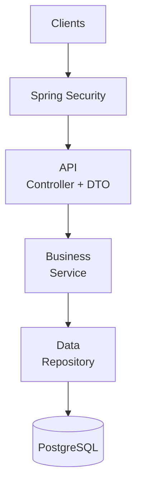
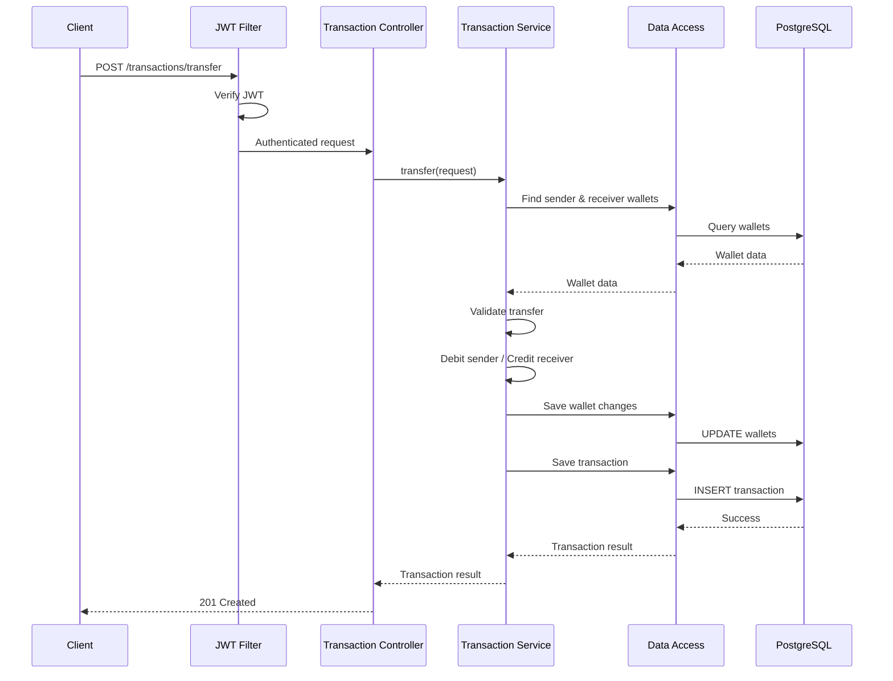
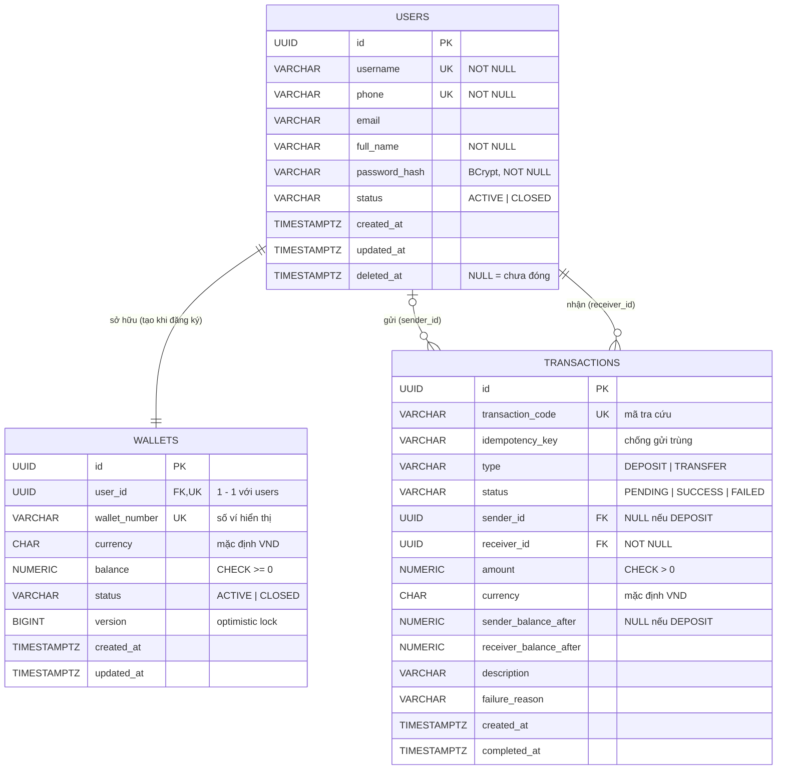
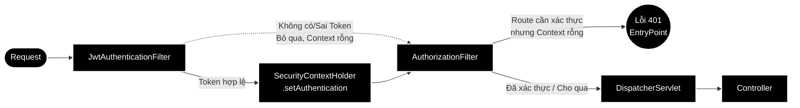

#  E-Wallet Backend 

> Bài tập lớn - **Pha 1**: Xây dựng dịch vụ backend Ví điện tử (E-Wallet) với các chức năng cơ bản.
> Pha 2 sẽ dựa trên mã nguồn này để cải tiến các thuộc tính chất lượng.

---

##  Mục lục

1. [Giới thiệu & Mục tiêu](#1-giới-thiệu--mục-tiêu)
2. [Thành viên nhóm](#2-thành-viên-nhóm)
3. [Công nghệ sử dụng](#3-công-nghệ-sử-dụng)
4. [Kiến trúc hệ thống](#4-kiến-trúc-hệ-thống)
5. [Cấu trúc thư mục](#5-cấu-trúc-thư-mục)
6. [Mô hình dữ liệu](#6-mô-hình-dữ-liệu)
7. [Đặc tả API](#7-đặc-tả-api)
8. [Bảo mật & Xác thực](#8-bảo-mật--xác-thực)


---

## 1. Giới thiệu & Mục tiêu

**E-Wallet** là dịch vụ backend RESTful mô phỏng các nghiệp vụ cốt lõi của một ví điện tử:

| Nghiệp vụ | Mô tả |
|---|---|
|  **Xác thực** | Đăng ký tài khoản, đăng nhập nhận JWT, xóa tài khoản |
|  **Nạp tiền** | Nạp tiền vào ví của người dùng hiện tại |
|  **Chuyển tiền** | Chuyển tiền giữa hai ví trong hệ thống |
|  **Lịch sử giao dịch** | Xem danh sách và chi tiết các giao dịch của bản thân |

### Phạm vi Pha 1

-  REST API, giao tiếp qua **JSON**, đủ các method **GET / POST / DELETE**.
-  Tài liệu API tự động bằng **OpenAPI / Swagger UI**.
-  Kiến trúc 3 lớp đơn giản: `API (Controller) → Business (Service) → Data Access (Repository)`.
-  Truy cập dữ liệu qua **Repository pattern** + **ORM (Spring Data JPA / Hibernate)**.
-  Đăng nhập & xác thực tập trung tại Security Filter, không lặp lại trong từng endpoint.
-  Đóng gói bằng **Docker** / **Docker Compose**.
-  Kiểm thử tải trên **Kaggle CPU**.

---

## 2. Thành viên nhóm

| STT | Họ và tên     | MSSV     | Vai trò               | Phụ trách chính |
|:---:|---------------|----------|-----------------------|---|
| 1 | Đinh Quang Tuân | 24021654 | Backend / Security    | User, đăng ký/đăng nhập, JWT, Spring Security |
| 2 | Đặng Duy Anh  | 24021358 | Backend / Wallet      | Wallet, số dư, Wallet Service, Wallet Repository |
| 3 | Lê Tùng Dương | 24021438 | Backend / Transaction | Transaction, chuyển tiền, business logic giao dịch, transaction history |
| 4 | Hoàng Đức Nhuận | 24021590 | DevOps / QA           | DTO, Mapper, Swagger/OpenAPI, Docker, integration & load testing trên Kaggle |


---

## 3. Công nghệ sử dụng

| Thành phần | Công nghệ | Mục đích                        |
|---|---|---------------------------------|
| Ngôn ngữ | Java 21 | Ngôn ngữ chính                  |
| Framework | Spring Boot 4.1.1 | REST API                        |
| Bảo mật | Spring Security + JWT (HS256) | Đăng nhập, xác thực qua filter  |
| ORM | Spring Data JPA / Hibernate | Repository, ánh xạ O/R          |
| CSDL | PostgreSQL 16 | Lưu trữ dữ liệu                 |
| Validation | Jakarta Bean Validation | Kiểm tra dữ liệu request        |
| Mapping | MapStruct, Lombok | Chuyển đổi DTO ↔ Domain ↔ Entity |
| Tài liệu API | springdoc-openapi (Swagger UI) | OpenAPI 3                       |
| Đóng gói | Docker, Docker Compose | Triển khai                      |
| Kiểm thử tải | Locust (Python) trên Kaggle Notebook (CPU) | Load testing                    |

---

## 4. Kiến trúc hệ thống

### 4.1. Tổng quan kiến trúc 3 lớp


### 4.2. Nguyên tắc phụ thuộc (Dependency Rule)

```
   api ───────────▶ business ───────────▶ data
 (Controller)       (Service)         (Repository)
```

### 4.3. Luồng xử lý một request (Ví dụ: Chuyển tiền)



## 5. Cấu trúc thư mục 


```
E-wallet/
├── README.md
├── docker-compose.yml
├── loadtest/
│   └── locustfile.py
│
└── eWallet/
    ├── Dockerfile
    ├── pom.xml
    │
    └── src/
        ├── main/
        │   ├── java/uet/com/eWallet/
        │   │
        │   ├── EWalletApplication.java
        │   │
        │   ├── api/                              
        │   │   ├── controller/
        │   │   │   ├── AuthController.java
        │   │   │   ├── UserController.java
        │   │   │   ├── WalletController.java
        │   │   │   └── TransactionController.java
        │   │   │
        │   │   └── dto/
        │   │       ├── ApiResponse.java
        │   │       │
        │   │       ├── request/
        │   │       │   ├── RegisterRequest.java
        │   │       │   ├── LoginRequest.java
        │   │       │   └── TransferRequest.java
        │   │       │
        │   │       └── response/
        │   │           ├── LoginResponse.java
        │   │           ├── UserResponse.java
        │   │           ├── WalletResponse.java
        │   │           └── TransactionResponse.java
        │   │
        │   ├── business/                         
        │   │   │                                 
        │   │   ├── service/
        │   │   │   ├── AuthService.java
        │   │   │   ├── UserService.java
        │   │   │   ├── WalletService.java
        │   │   │   └── TransactionService.java
        │   │   │
        │   │   └── exception/
        │   │       ├── BusinessException.java
        │   │       ├── UserNotFoundException.java
        │   │       ├── WalletNotFoundException.java
        │   │       ├── InsufficientBalanceException.java
        │   │       └── InvalidTransferException.java
        │   │
        │   ├── data/                             
        │   │   ├── entity/
        │   │   │   ├── User.java
        │   │   │   ├── Wallet.java
        │   │   │   └── Transaction.java
        │   │   │
        │   │   ├── repository/
        │   │   │   ├── UserRepository.java
        │   │   │   ├── WalletRepository.java
        │   │   │   └── TransactionRepository.java
        │   │   │
        │   ├── security/
        │   │   ├── SecurityConfig.java
        │   │   ├── JwtAuthenticationFilter.java
        │   │   ├── JwtTokenProvider.java
        │   │   └── BCryptPasswordHasher.java
        │   │
        │   ├── mapper/
        │   │   ├── UserMapper.java
        │   │   ├── WalletMapper.java
        │   │   └── TransactionMapper.java
        │   │
        │   ├── exception/
        │   │   └── GlobalExceptionHandler.java
        │   │
        │   └── config/
        │       └── OpenApiConfig.java
        │
        └── resources/
            └── application.yaml

        └── test/
            └── java/uet/com/eWallet/
                ├── architecture/
                │   └── ArchitectureTest.java
                │
                ├── business/
                ├── api/
                └── integration/                    
```

---

## 6. Mô hình dữ liệu


| Quan hệ | Bản số | Ý nghĩa |
|---|:------:|---|
| `users` – `wallets` | 1 – 1  |  Mỗi người dùng có đúng một ví, tạo tự động khi đăng ký |
| `users` – `transactions` (gửi) | 1 – N  | Các giao dịch người dùng là bên gửi |
| `users` – `transactions` (nhận) | 1 – N  |  Các giao dịch người dùng là bên nhận |



## 7. Đặc tả API


### 7.1. Danh sách endpoint

| # | Method | Endpoint                | Mô tả                                         | Xác thực | Thành công |
|:-:|:---:|-------------------------|-----------------------------------------------|:--------:|:---:|
| 1 | `POST` | `/auth/register`        | Đăng ký tài khoản (tự động tạo ví, số dư 0)   |  Public  | `201` |
| 2 | `POST` | `/auth/login`           | Đăng nhập, nhận JWT access token              |  Public  | `200` |
| 3 | `GET` | `/accounts/me`          | Xem thông tin ví & số dư hiện tại             |   JWT  | `200` |
| 4 | `POST` | `/accounts/me/deposits` | Nạp tiền vào ví                               |   JWT  | `201` |
| 5 | `POST` | `/transfers`            | Chuyển tiền sang ví khác                      |   JWT  | `201` |
| 6 | `GET` | `/transactions`         | Lịch sử giao dịch (phân trang, lọc theo loại) |   JWT  | `200` |
| 7 | `GET` | `/transactions/{id}`    | Chi tiết một giao dịch                        |   JWT  | `200` |
| 8 | `DELETE` | `/accounts/me`          | Đóng tài khoản (chỉ khi số dư = 0)            |   JWT  | `204` |


### 7.2. Định dạng phản hồi chung

```json
{
  "code": 1000,
  "message": "Success",
  "result": { }
}
```

| HTTP | `code` | Ý nghĩa |
|:---:|:---:|---|
| 200 / 201 | `1000` | Thành công |
| 400 | `1001` | Dữ liệu không hợp lệ (validation) |
| 401 | `1002` | Chưa xác thực / token không hợp lệ hoặc hết hạn |
| 403 | `1003` | Không có quyền truy cập tài nguyên |
| 404 | `1004` | Không tìm thấy (user / ví / giao dịch) |
| 409 | `1005` | Xung đột (username/phone đã tồn tại) |
| 422 | `2001` | Số dư không đủ |
| 422 | `2002` | Không thể tự chuyển tiền cho chính mình |
| 500 | `9999` | Lỗi hệ thống |


## 8. Bảo mật & Xác thực

- **Đăng nhập:** `POST /auth/login` → kiểm tra mật khẩu (băm bằng BCrypt) → phát hành JWT (HS256, hạn 60 phút).
- **Xác thực tập trung:** toàn bộ việc kiểm tra token được thực hiện bởi **`JwtAuthenticationFilter`**  trong **Spring Security Filter Chain**.




<p align="center"><i>E-Wallet Backend · Pha 1</i></p>